<div align="center">



<br/>


<br/>


</div>


## `> whoami`

```bash
> const dev = {
    name: "Clément Renaux",
    school: "EPITA Lyon — Développement et Industrie du Futur",
    focus: ["compilers", "backend APIs", "systems programming"],
    lookingFor: "6-month software dev internship, EU, starting Sept 2026",
    currentlyBuilding: "a Tiger language compiler with generics (turbofish syntax 🦀)",
    funFact: "will happily debate FC Barcelona tactics or UFC fight cards"
  };
```

<br/>

## `> ls ./stack --hover-for-names`

<div align="center">


<br/><br/>


<br/><br/>

<sub><i>+ C · SQL · Ada · Quarkus · Bison / RE-flex · Autotools · Axum — no official brand logo, so they're not pictured here</i></sub>

</div>

<br/>

## `> ls ./projects`

<table>
<tr>
<td width="50%" valign="top">

### 🌲 Tiger Compiler
Full compiler for the Tiger language — scanner, parser, AST, binder, typechecker and C codegen, extended with generics/templates using turbofish-style monomorphization.
<br/>
`C++` `RE-flex` `Bison` `Autotools`

</td>
<td width="50%" valign="top">

### 🎮 Yakamon API
REST backend for a Pokémon-like game with layered architecture, service/converter separation and a full test suite.
<br/>
`Java` `Quarkus` `JUnit`

</td>
</tr>
<tr>
<td width="50%" valign="top">

### 📦 Smart Pallet
Warehouse logistics service for pallet tracking and routing.
<br/>
`Rust` `Axum`

</td>
<td width="50%" valign="top">

### 🗺️ Snow Route Optimization
Chinese Postman Problem solver on real OSMnx map data, with report generation and an interactive HTML/JS viewer.
<br/>
`Python` `OSMnx` `Excel`

</td>
</tr>
<tr>
<td width="50%" valign="top">

### 🐳 Containerized Microservices
Multi-stage Dockerized Go services with a full observability stack.
<br/>
`Go` `Docker` `Redis` `Prometheus` `Grafana`

</td>
<td width="50%" valign="top">

### 🗄️ USTAR Archiver & Config Parser
Low-level C tooling: a USTAR-format file archiver and a system config parser with a custom string library.
<br/>
`C`

</td>
</tr>
</table>

<br/>

## `> git log --stats`

<div align="center">


<br/>


</div>

<br/>

## `> contribution --snake`

<div align="center">


<sub>generated automatically — see `.github/workflows/snake.yml` below</sub>
</div>

<br/>


<div align="center">

📫 **clement.renaux@epita.fr** &nbsp;·&nbsp; [GitHub](https://github.com/clementrnx)

*Open to internship opportunities across the EU — let's talk!*

</div>
